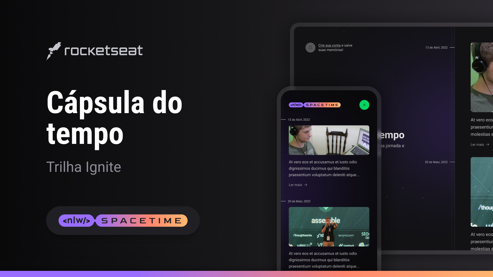

<h1 align="center">
  🚀 Spacetime 🕐
</h1>

<p align="center">
  
  
  
  

</p>
---

<p align="center">
  <a href="#-projeto">Projeto</a>&nbsp;&nbsp;&nbsp;|&nbsp;&nbsp;&nbsp;
  <a href="#-como-rodar-o-projeto">Como rodar o projeto</a>&nbsp;&nbsp;&nbsp;|&nbsp;&nbsp;&nbsp;
  <a href="#-tecnologias">Tecnologias</a>&nbsp;&nbsp;&nbsp;|&nbsp;&nbsp;&nbsp;
  <a href="#-layout">Layout</a>&nbsp;&nbsp;&nbsp;|&nbsp;&nbsp;&nbsp;
  <a href="#-licença">Licença</a>
</p>

## 💻 Projeto

Spacetime é uma aplicação inovadora desenvolvida para ajudar as pessoas a armazenar e reviver suas memórias mais marcantes. Com recursos avançados de registro, como data, mídias (fotos/vídeos) e descrição, Spacetime permite que os usuários capturem e compartilhem momentos importantes de suas vidas.

## 📁 Repositórios

- [Web](https://github.com/vitorsemidio-dev/spacetime-web)
- [Mobile](https://github.com/vitorsemidio-dev/spacetime-mobile)
- [Server](https://github.com/vitorsemidio-dev/spacetime-server)


## 🧭 Como rodar o projeto

### Pré-requisitos

- É necessário ter configurado OAuth Apps no Githug. [https://github.com/settings/developers](https://github.com/settings/developers)
- Preencher os valores das variáveis `GITHUB_CLIENT_ID` e `GITHUB_CLIENT_SECRET` no .env

```
# Database 
DATABASE_URL="file:./dev.db"

# Github
GITHUB_CLIENT_ID=
GITHUB_CLIENT_SECRET=
```

**Clone o repositório**

```bash
git clone https://github.com/vitorsemidio-dev/spacetime-server.git
```

**Instale as dependências**

```bash
npm install
```

**Execute as migrations**

```bash
npx prisma migrate dev
```

**Inicie a aplicação**

```bash
npm run dev
```

## 🚀 Tecnologias

Esse projeto foi desenvolvido com as seguintes tecnologias:

- [Fastify](https://www.fastify.io/)
- [Node.js](https://nodejs.org/en/)
- [Prisma](https://www.prisma.io/)
- [Sqlite](https://www.sqlite.org/index.html)
- [TypeScript](https://www.typescriptlang.org/pt/)

## 🔖 Layout

Você pode visualizar o layout do projeto através [deste link](https://www.figma.com/community/file/1240070456276424762/C%C3%A1psula-do-tempo-%E2%80%A2-Trilha-Ignite).

<a href="https://www.figma.com/community/file/1240070456276424762/C%C3%A1psula-do-tempo-%E2%80%A2-Trilha-Ignite">
  
</a>

## 📓 Notion

- [Trilha Explorer](https://efficient-sloth-d85.notion.site/Trilha-Explorer-24b881e55cdf4c1ea0c77bea83e6160f)
- [Trilha Ignite](https://efficient-sloth-d85.notion.site/Trilha-Ignite-e2ed19139b544a46984a28b65dcd4aae)

## 📝 Licença

Esse projeto está sob a licença MIT. Veja o arquivo [LICENSE](LICENSE) para mais detalhes.
